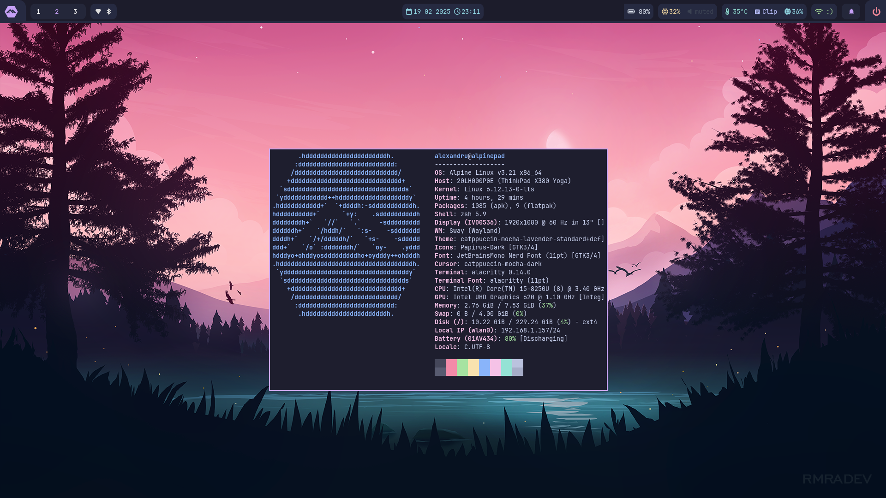
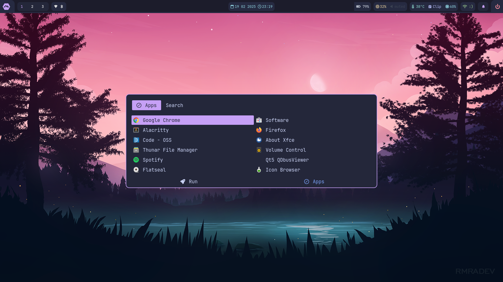
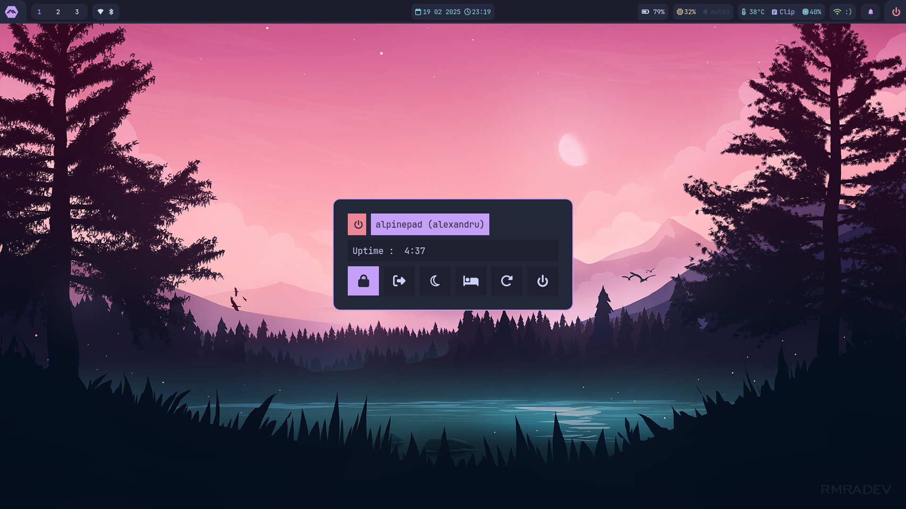
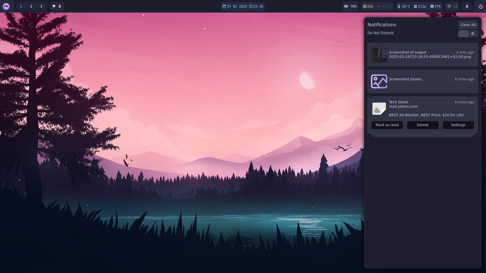
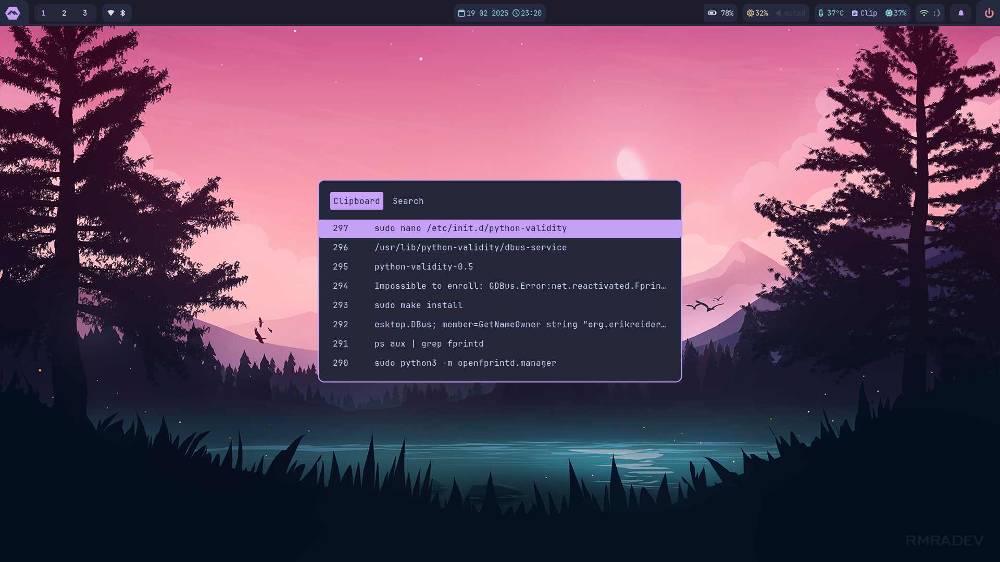
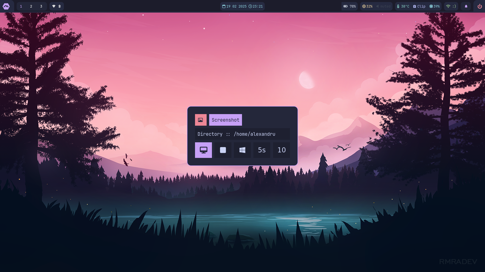
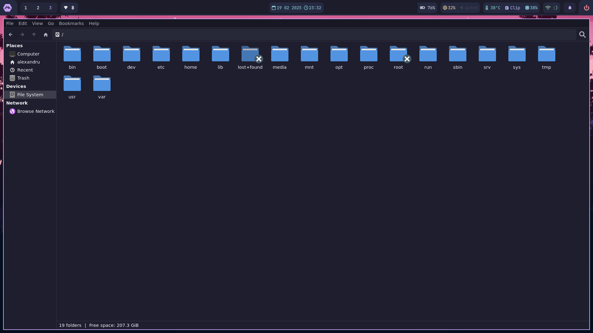

# 🌿 Alpine Sway-WM Dotfiles

## 🔥 System Information

|    Component    | Details |
| :------------: | :-----------------------------------------------------------------------------------------: |
|    **Distro**    | [Alpine Linux](https://www.alpinelinux.org/) - [3.18.12](https://www.alpinelinux.org/#:~:text=2025%2D02%2D13-,Alpine%203.18.12,-%2C%203.19.7%2C%203.20.6%20and) |
|      **WM**      | [Sway](https://swaywm.org/) (i3-compatible tiling WM for Wayland) |
|   **Terminal**   | [Alacritty](https://github.com/alacritty/alacritty) (GPU-accelerated terminal) |
|    **Shell**     | [Zsh + Zap](https://www.zapzsh.org/) + [Starship](https://starship.rs/) (for a modern prompt) |
|   **Launcher**   | [Rofi (Wayland)](https://github.com/lbonn/rofi) |
|  **Clipboard**   | [Cliphist](https://github.com/sentriz/cliphist) |
| **File Manager** | [Thunar](https://docs.xfce.org/xfce/thunar/start) |

---

## 🎨 Theme & Appearance

This setup uses **Catppuccin Mocha** as the primary theme across all components:

- **GTK Theme**: [Catppuccin GTK](https://github.com/catppuccin/gtk)
- **Cursor Theme**: Catppuccin Mocha
- **Sway Notification Center (swaync)**: Catppuccin Mocha
- **Sway Window Manager**: Catppuccin Mocha

For applying the GTK theme, follow [these instructions](https://github.com/catppuccin/gtk/blob/main/docs/USAGE.md).

---

## 🖼️ Gallery

Here are some screenshots of the setup:









---

## 💻 Installation Guide

### 1️⃣ Clone the Repository

```sh
git clone https://github.com/zanderp/alpine-swaywm-dotfiles.git
```

### 2️⃣ Copy Configuration Files

⚠️ **WARNING: This will overwrite your existing configuration. Backup your files first!**

```sh
cd alpine-swaywm-dotfiles
cp -r .config/* ~/.config/
cp -r .zshrc ~/
```

### 3️⃣ Install Dependencies

#### **For Alpine Linux**
```sh
sudo apk add sway swaybg waybar jq findutils mpd ncmpcpp swayidle wf-recorder dmenu brightnessctl mako \
             cliphist grim slurp pamixer polkit-gnome starship xdg-user-dirs xdg-utils gvfs gvfs-mtp gvfs-nfs \
             wl-clipboard playerctl alacritty network-manager-applet grimshot yad xdg-desktop-portal-wlr \
             rofi swaylock-effects ttf-jetbrains-mono-nerd
```

#### **Zsh & Zap Installation**
```sh
zsh <(curl -s https://raw.githubusercontent.com/zap-zsh/zap/master/install.zsh) --branch release-v1
```
More details can be found on [Zap's GitHub](https://github.com/zap-zsh/zap).

---

## 🔧 Additional Customizations

### 🖌️ **Theme (Catppuccin Mocha)**
To apply the **Catppuccin Mocha** GTK theme, follow the official [setup guide](https://github.com/catppuccin/gtk/blob/main/docs/USAGE.md).

### 🔐 **Swaylock Effects**
Swaylock Effects adds a nice lock screen with blur effects.
Install it with:
```sh
sudo apk add swaylock-effects
```

### 🔤 **Fonts**
JetBrains Mono Nerd Font is used for icons and powerline features.
```sh
sudo apk add ttf-jetbrains-mono-nerd
```

---

## ✅ Final Notes

Once everything is set up, restart your session or run:
```sh
exec sway
```

Please look over the `~/.config/sway/config` file so you can see the basic key bindings. Use MOD+ALT+R to reload sway to apply changes without restarting the session. 

Enjoy your **minimalist but powerful** Wayland setup! 🚀
